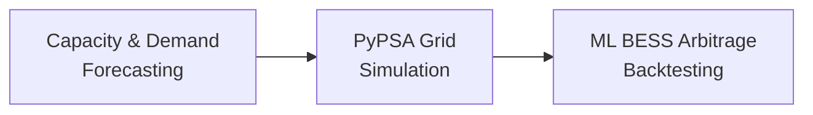

<div align="center">

# ⚡ BESS Arbitrage & Power System Simulation

### German Power Grid Digital Twin — 2030 Projection

[](https://www.python.org/)
[](https://pypsa.org/)
[](https://xgboost.readthedocs.io/)
[](#license)

A Python pipeline for modeling the German power grid, projecting renewable capacity to 2030, and evaluating ML-driven Battery Energy Storage System (BESS) arbitrage strategies.

</div>

---

## Table of Contents

- [Overview](#overview)
- [Pipeline](#pipeline)
  - [1. Capacity & Demand Forecasting](#1-capacity--demand-forecasting)
  - [2. PyPSA Grid Simulation](#2-pypsa-grid-simulation)
  - [3. ML-Driven BESS Arbitrage Backtesting](#3-ml-driven-bess-arbitrage-backtesting)
- [Installation](#installation)
- [Execution Workflow](#execution-workflow)
- [Outputs](#outputs)

---

## Overview

This repository combines time-series forecasting, optimal power flow modeling, and machine learning to simulate how battery storage can arbitrage electricity prices on a 2030 German grid with high renewable penetration.

The pipeline runs in three stages, each feeding the next:



---

## Pipeline

### 1. Capacity & Demand Forecasting

| | |
|---|---|
| **Models** | ARIMA, Holt-Winters Exponential Smoothing |
| **Input** | Historical ENTSO-E generation capacity and demand data (Germany) |
| **Output** | `pypsa_capacity_2030.csv` — capacity matrix used to scale the grid model |

Predicts capacity and demand values forward to 2030.

### 2. PyPSA Grid Simulation

| | |
|---|---|
| **Tools** | PyPSA, Gurobi solver, Linopy |
| **Input** | Baseline network (`base_s_50_elec_.nc`), 2030 capacity forecasts |
| **Output** | Combined annual + 2030 projection networks (`.nc`), `metrics_annual.csv`, LMP distributions, dispatch plots |

Scales the baseline network, adds BESS units to AC buses, enforces RE constraints, and optimizes monthly dispatch.

> **Note:** Requires an active Gurobi academic or commercial license.

### 3. ML-Driven BESS Arbitrage Backtesting

| | |
|---|---|
| **Models** | XGBoost (quantile regression), SciPy (LP oracle) |
| **Input** | Historical PyPSA network data |
| **Output** | Financial performance summaries, capture ratios, dispatch heatmaps, forecast accuracy metrics |

Trains q10/q50/q90 LMP forecasters, learns charge/discharge thresholds, and backtests dispatch against a naive persistence baseline and a perfect-foresight LP oracle.

---

## Execution Workflow

```bash
# 1. Generate the 2030 capacity forecasting matrix
python forecasting.py

# 2. Run the PyPSA grid simulation
python grid_simulation.py   # calls run_monthly_simulations()

# 3. Train and backtest the ML arbitrage strategy
python ml_backtest.py
```

| Step | Script | Produces |
|---|---|---|
| 1 | Forecasting | `pypsa_capacity_2030.csv` |
| 2 | Grid Simulation | `metrics_annual.csv`, network `.nc` files, LMP plots |
| 3 | Arbitrage Backtest | Revenue summaries, capture ratios, heatmaps |

---

## Outputs

- 📊 2030 renewable capacity projections
- ⚙️ Optimized monthly dispatch networks
- 💰 BESS arbitrage revenue vs. LP oracle benchmark
- 📈 LMP forecast accuracy (q10/q50/q90)
